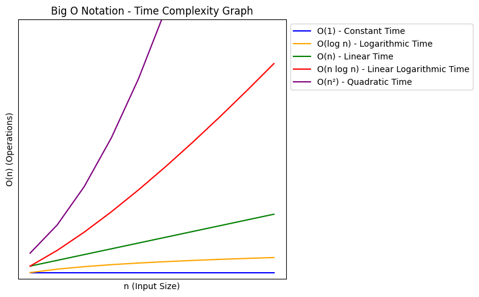

# Intro to Time Complexity

## Introduction

Speed is really important to software and algorithms. Really, really important. This isn't surprising, given that they're expected to process unimaginably large numbers of operations to accomplish certain goals and tasks.

Here's a simple example. Suppose you want to find a target number from a list of 10 numbers. This seems straightforward enough—just start from the front of the list and iterate through the numbers until you find the one you're looking for.

But what if, instead of 10 numbers, we had 10 million numbers? Suddenly, the task isn't so straightforward. Let's assume it takes about 1 second to check each number; finding a target number among 10 numbers would take approximately 10 seconds. Now, imagine scaling that up to 10 million numbers. It would then take 10 million seconds, or over 115 days, to potentially find your target number using the same method. As the size of the data increases, the time it takes to find the target number also increases, potentially becoming impractical for very large datasets.

This is where the concept of **time complexity** comes in- the theoretical estimated time it takes for an algorithm or function to run. It helps developers predict the scalability of their software and make informed choices about which algorithms to use in different scenarios.

Let's go back to our example earlier to illustrate this. Let's use two search algorithms- `linear search` and `binary search`- to illustrate the possible differences in algorithm speed.

| Algorithm      | Number of Elements | Execution Time (avg seconds) |
|----------------|--------------------|------------------------------|
| Linear Search  | 10                 | 0.000005                     |
| Linear Search  | 10,000,000         | 0.672798                     |
| Linear Search  | 100,000,000        | 6.476439                     |
| Binary Search  | 10                 | 0.000006                     |
| Binary Search  | 10,000,000         | 0.000026                     |
| Binary Search  | 100,000,000        | 0.000027                     |


Incredible, isn't it? There's no real difference in run speed with 10 elements, but with 10 million elements, the difference becomes obvious- ``binary search`` is a remarkable 25876 times faster than ``linear search``!

But it gets better- with 100 million elements ``binary search`` is an astounding 239,498,481 times faster than ``linear search``!

This is due to the difference in time complexity between the two algorithms-

``Linear search``, which checks each element sequentially until it finds the target, has a time complexity of **O(n)**, where "n" represents the number of elements in the list. This means its execution time increases linearly with the number of elements.


``Binary search``, which repeatedly divides the sorted list in half until it finds the target, has a time complexity of **O(log n)**. This means its execution time grows logarithmically with the number of elements. In practical terms, even if the number of elements grows very large, the number of steps required to find the target increases only slightly.

This example exemplifies the practical impact of understanding time complexities: by choosing an algorithm with a more efficient time complexity, developers can significantly enhance the performance and scalability of their software. With data volumes exploding and the demand for speed ever increasing, it's really a no-brainer why such kowing your time complexity are invaluable for creating responsive and efficient applications.

This articles provides an introduction to the key concepts in time complexities like the Big O notation, the most common time complexities in algorithm and data structures, and how to interpret and analyze them. This article won't be a deep dive into the complexities of specific algorithms or data structures (that will be covered other articles), but it will lay the groundwork for understanding the basics behind time complexities and those basic time complexities.

Let's get started.

## Big O Notation
In computer science, time complexity is measured by using a mathematical notation known as the ``Big O notation``. Simply put, the ``Big O notation`` is a way of explaining how a function or algorithm grows as its input size increases. Calculating an algorithm's ``Big O notation`` gives you a theoretical maximum estimate of the resources required as input size scales. It focuses on the worst-case scenario, helping programmers understand the upper limit of an algorithm's execution time or space requirements.

This makes understanding ``Big O notation`` incredibly important- it helps the developer understand the potential costs of running an algorithm, especially as the scale of data increases. By evaluating the time complexity in terms of ``Big O notation``, developers can anticipate how their software will perform under different conditions, allowing them to make informed decisions about algorithm design and optimization.

### Common Big O Notations of Time Complexity

There are many ``Big O notations``, but fortunately there's only 5 that are essential for understanding algorithm efficiency. Here they are listed in the order of efficiency- from most to least efficient in typical scenarios.



| Name               | Big O Notation | Definition                                                                                               |
|--------------------|----------------|----------------------------------------------------------------------------------------------------------|
| Constant Time      | O(1)           | The execution time remains constant regardless of the input data size. This means that the algorithm's speed doesn't change no matter the size of the input. Examples include accessing a specific array element by index or checking if a number is even or odd.|
| Logarithmic Time   | O(log n)       | The execution time increases logarithmically with the increase in input data size. This means that as you double the amount of data, the number of additional operations needed increases only slightly. In other words, every time the input size doubles, the execution time grows by just a small increment. This slow rate of growth in execution time is what we call logarithmic. It's a common characteristic of efficient algorithms like binary search.|
| Linear Time        | O(n)           | The execution time increases linearly with the input data size. This means that the algorithm's speed scales directly with the size of the input. A simple example would be a loop that checks each input element.|
| Linear Logarithmic Time | O(n log n)     | The execution time increases both linearly and logarithmically with the input data size. This is effectively a combination of linear time and logarithmic time, meaning it processes each element (``O(n)``) in logarithmic time(``O(log n)``).Essentially, the algorithm performs a series of operations on all elements, but the number of operations necessary for each element decreases as the process progresses. Examples include sorting algorithms like merge sort and QuickSort.|
| Quadratic Time     | O(n²)          | The execution time increases quadratically with the input size. This means that the algorith must perform a task that pairs every element with every other element, such as nested loops over the same dataset. Examples include bubble sort or checking all pairs in an array.|

## Understanding and Calculating Time Complexity

Calculating a specific code's time complexity can become rather complicated, and providing a detailed look into this topic is beyond this article's scope. Instead, let's focus on the big picture- the main concepts in calculating time complexity. Understanding these will give you an idea of what to look for when analyzing an algorithm's efficiency and performance.

Calculating time complexity is like calculating an algebraic expression, but instead of numbers, you're working with the number of operations that an algorithm performs relative to the size of its input. This involves understanding several key concepts:

* **Identify Operation Counts** 

    Start by identifying operations- such as loops, recursive calls, comparisons, assignments, and arithmetic operations- that may significantly affect the runtime. Focus on operations that increase with the size of the input data; the idea is to look for operations that repeat and whose repetition is dependent on the size of the input.

* **Determine Growth Patterns**

    Once the critical operations are identified, the next step is to determine how the frequency of these operations changes with an increase in input size. This involves recognizing patterns in how operations scale. For example:

    * Linear Growth: Operations increase proportionally with the input size.
    * Logarithmic Growth: Operations increase by a factor that decreases with increasing input size, typical of divide-and-conquer algorithms like binary search.
    * Quadratic Growth: Operations increase with the square of the input size, often seen with nested loops.

    Understanding these growth patterns helps in categorizing the algorithm into a specific complexity class (like ``O(n)``, ``O(n²)``, ``O(log n)``, etc).

* **Simplify the Expression**

    Because Big O notation is intended to measure the worst-case scenario, we can simplify most expressions to focus only on the term that will have the biggest impact as the input size grows very large. This means:

    * Ignoring constants: Since constants (``O(1)``) do not change the growth rate of the function, they can be omitted when expressing time complexity in Big O notation. This simplification helps in focusing on how changes in input size affect the performance without being distracted by constants which do not impact scalability.

    * Focusing on the highest order term: In an expression like ``O(n)``+``O(n²)``, ``O(n²)`` comes to dominate as n increases. So we can simplify the overall calculation by simplifying the expression down to ``O(n²)``

    Simplifying the expression makes it easier to understand and communicate the fundamental scalability of the algorithm.

### #1 Linear Time Example

```python
def count_elements(elements):
    print("Starting to count elements...")
    count = 0

    for element in elements:
        count += 1 
    return count
```

Let's examine the operations within the function ``count_elements``

* It prints out a statement. 

    This operation executes only once, regardless of how many elements are in the input list. Therefore this operation runs at constant time ``O(1)``

* It loops through every element in its input and adds it to count.

    This operation runs for every single element in the input list, meaning it scales directly with the size of the input list. Therefore this operation runs at linear time ``O(n)``

The overall time complexity of ``count_elements`` can now be found by taking the sum of the individual complexities (``O(1)+O(n)``) and simplifying it to focus on the 'costliest' time complexity. Since ``O(n)`` grows faster than ``O(1)`` as n increases, ``O(1)`` becomes negligible, and the overall time complexity simplifies to ``O(n)``.

### #2 Quadratic Time Example

```python
def sum_all_pairs(elements):
    total_sum = 0
    for i in range(len(elements)):
        for j in range(len(elements)):
            total_sum += elements[i] + elements[j]
    return total_sum
```

Let's examine the operations within the function ``sum_all_pairs``

* It initializes a variable total_sum to 0.

    This initialization is a single operation, executed once, and htherefore runs at constant time ``O(1)``.

* It uses nested loops, where each loop iterates over the entire list elements.

    The outer and inner loops each run n times, where n is the number of elements. Every combination of loop iterations (i, j) performs an addition, resulting in a total of n * n operations. This means the number of operations is proportional to the square of the input size, n², indicating quadratic growth. Therefore, the time complexity of this operation is ``O(n²)``.

The overall time complexity of ``sum_all_pairs`` is primarily determined by the nested loops, and therefore we can simplify (``O(1)+O(n²)``) down to ``O(n²)``.

### #3 Logarithmic Time Example
```python
def log_operations(n):
    count = n
    operations = 0
    while count > 1:
        count //= 2
        operations += 1
    return operations
```

Let's examine the operations within the function ``log_operations``

* Initialize Variables

    The initialization of count and operations happens once, therefore it operates at constant time ``O(1)``.

* While Loop

    The loop divides the value of count by two (``count //= 2``) in each iteration. This operation significantly reduces the remaining iterations needed as the loop progresses. Since the loop's condition is halved each time, the number of iterations needed to reduce count to 1 is proportional to the logarithm of the initial value n. This is because each halving operation gets you exponentially closer to 1, reducing the problem size in logarithmic steps. Therefore, this part of the function operates at logarithmic time ``O(log n)``.

Thus the overall time complexity of ``log_operations`` can be simplified to ``O(log n)``

### #4 Linear Logarithmic Time Example
```python
def linear_logarithmic_operations(n):
    count = 0
    for i in range(1, n + 1):
        j = i
        while j < n:
            count += 1
            j *= 2

    print("Total operations:", count)
```
Let's examine the operations within the function ``linear_logarithmic_operations``

* For Loop

    This for loop runs from 1 to n, which clearly indicates it operates n times, thus runs in linear time ``O(n)``.

* While Loop within For Loop

    The while loop inside the for loop doubles j with each iteration (j *=2).This while loop runs logarithmically relative to n because each multiplication by 2 significantly reduces the number of iterations needed as j approaches n. Hence, for each iteration of the for loop, the while loop runs in ``O(log n)`` times.

The overall time complexity of ``linear_logarithmic_operations`` is determined by the nested loop structure. The outer for loop runs in ``O(n)`` time, while the inner while loop runs up to ``O(log n)`` times for each iteration of the for loop. We can then calculate that as ``O(n)``×``O(log n)``=``O(n log n)``

## Conclusion

Don't worry if you found calculating time complexity difficult- this subject takes time to learn and master. Like many foundational concepts in computer science, understanding time complexity and Big O notation requires practice and exposure to a variety of problems. It’s perfectly normal for these concepts to feel a bit abstract or challenging at first. As you continue to engage with different algorithms and their implementations, the ideas will become clearer and more intuitive. Patience and consistent practice are key to gaining proficiency in this area of programming.

As you continue to explore algorithms and data structures, keep in mind the time complexities discussed here. The following articles will explore a variety of data structures and algorithms, and the knowledge you learned from this article will help greatly in understanding and analyzing these codes.

## Appendix: Space Complexity

While speed is really important to software and algorithms, there's other equally important- space. As applications grow in complexity and handle larger datasets, the amount of memory they require can significantly impact their performance and feasibility, especially in resource-constrained environments like mobile devices or embedded systems.

This leads to the concept of **space complexity**- the theoretical estimated amount of space (or memory) required to an algorithm or function to run.

Space complexity doesn't get brought up as often time complexity primarily because modern computing environments typically offer substantial amounts of memory. This tends to make the time it takes to compute a solution more of a bottleneck than the space required to hold data. 

Nonetheless, understanding and optimizing for space complexity can be crucial in scenarios involving large data sets, limited hardware resources, or specific performance requirements.

This section will a give intro to space complexity, describing its Big O notations, how it's calculated, and its relationship with time complexity.

### Common Big O Notations of Space Complexity

Like time complexity, space complexity is also expressed using Big O notation. In this case, it gives you a way to describe how the amount of memory required by an algorithm scales with the size of the input.

Here's a brief overview of the most common Big O notations used to express space complexity:

| Name            | Big O Notation | Definition                                                                                                             |
|-----------------|----------------|------------------------------------------------------------------------------------------------------------------------|
| Constant Space  | O(1)           | The algorithm requires a fixed amount of space regardless of the input data size.                                      |
| Linear Space    | O(n)           | The space required grows linearly with the input data size. Examples include creating a list to store n elements.      |
| Quadratic Space | O(n²)          | The space requirement grows quadratically with the input size. An example could be an algorithm that creates a two-dimensional matrix based on the input size. |

### Calculating Space Complexity

Calculating space complexity involves analyzing what parts of an algorithm require memory storage. Here are some factors to consider:

* Variables: Count the total number of scalar variables that require space.

* Data Structures: Consider the size of structures such as arrays or hash tables and how they scale with input size.

* Function Call Stack: Include the space taken up by the call stack if the algorithm involves recursive calls, where each call adds a layer to the stack.

* Allocations: Any dynamic memory allocation during the execution needs to be counted toward the space complexity.

### Relationship Between Space and Time Complexity

There is often a trade-off between space and time complexity, known as the space-time trade-off.  For example, algorithms that cache large amounts of data for quick access (like memoization in recursive algorithms) may run faster but at the cost of increased memory usage. Conversely, algorithms that calculate values on the fly without storing intermediate results can often save space at the expense of more processing time.

It's important for developers to understand this trade-off, as optimizing for one often impacts the other. Effective algorithm design involves finding the right balance between time and space complexity to meet the application's needs and the constraints of the operating environment.

In summary, while space complexity might not always be the primary concern, it plays a crucial role in the overall efficiency of algorithms, especially in environments where memory is limited. Understanding both space and time complexities allows developers to make more informed decisions, optimizing their algorithms to achieve the best balance between speed and resource usage.