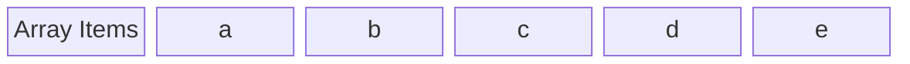
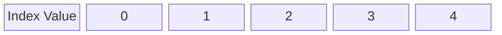
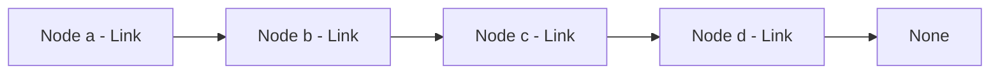
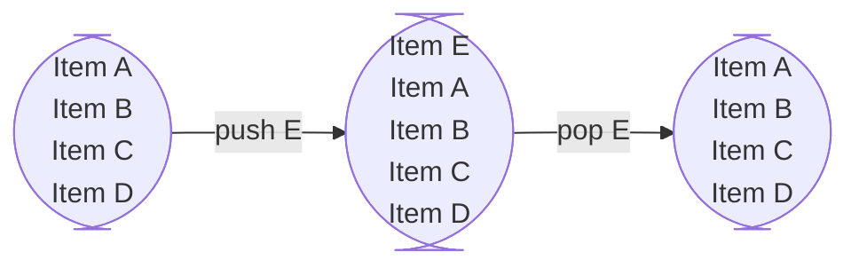
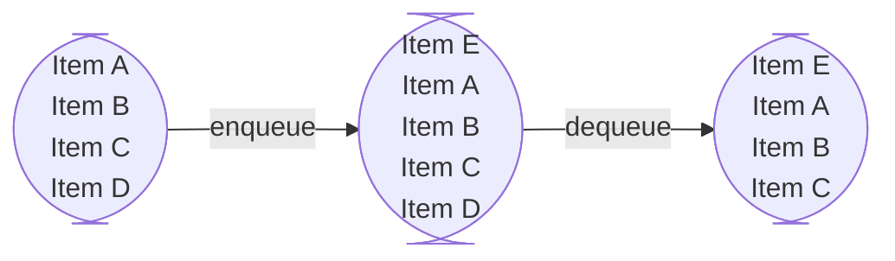
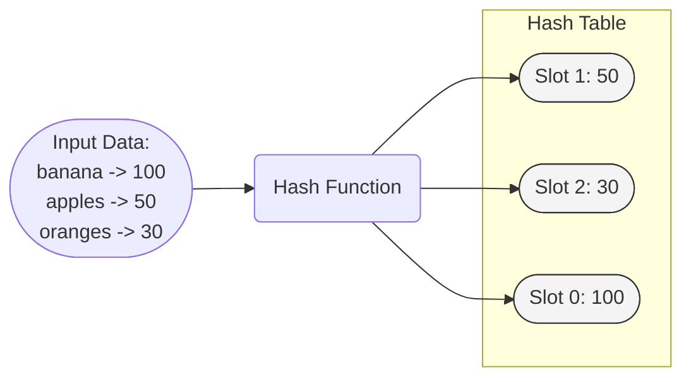
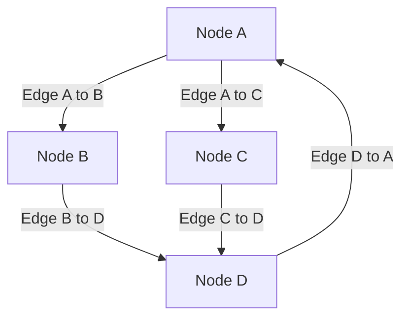
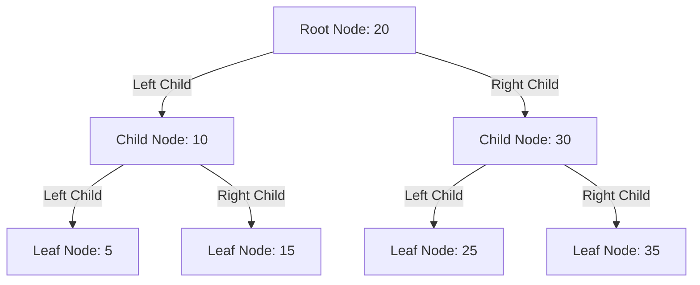
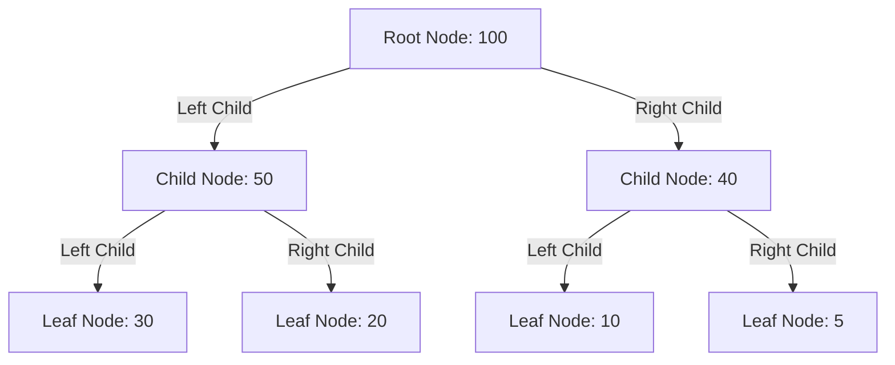
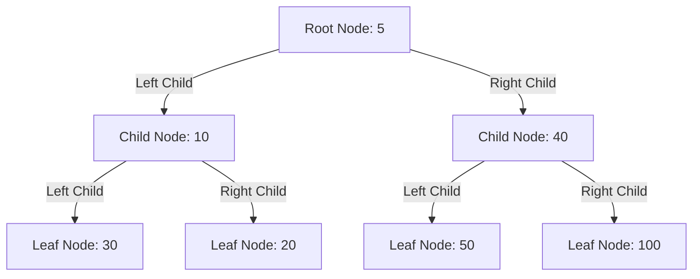

## Introduction

As you've been learning Python you would have certainly encountered objects such as lists, tuples, dictionaries, and sets and have learned to perform various tasks with them. But did you know that these object types aren't simply features of the Python language, but rather foundational elements of computer science known as **data structures**?

The name is fairly self explanatory- **data structures** are structures that store and organize data in a computer so that it can be processed accessed and modified efficiently. These structures form the backbone of data organization and management in programming, enabling efficient processing, storage, and retrieval of data. Each has unique properties and behaviors that make them suitable for different tasks and scenarios in your code.

In Python, you have already used some basic data structures, perhaps without categorizing them as such. When you use a **list** to store a sequence of items, you are actually employing a data structure called a **dynamic array**, which allows random access to items. Similarly, Python's **dictionaries** are implemented using a data structure called a **hash table**, which provides remarkably fast retrieval times. The names we use may be specific to Python, but the concepts are universal in computer science. 

Why should you care to learn about these data structures, especially if you're focused on Python? Here are a few compelling reasons:

* **Enhanced Problem-Solving Skills**
    
    Understanding the underlying mechanics of data structures can improve your ability to solve problems more efficiently and understand solutions that rely heavily on data organization.

* **Informed Decision-Making** 
    
    Knowing the strengths and weaknesses of different data structures helps you choose the most appropriate one for your needs, which can drastically affect the performance of your application.

* **Foundation for Advanced Learning** 

    Many advanced Python libraries and frameworks build upon these data structures, enhancing their functionality for specialized tasks like data analysis, web development, and machine learning.

* **Performance Optimization** 
    
    Proper use of data structures can lead to significant performance improvements in your programs, especially when dealing with large data sets or complex algorithms.

Suffice it to say that learning data structures and how to use them is well worth your time.

This article offers an introductory overview of the most popular data structures, summarizing their characteristics, intended use cases, and providing a brief comparison of each. By the end, you will have gained a foundational understanding of each data structure, equipping you to explore them in greater detail through our dedicated, in-depth articles.

Let's get started!

## Data Structures in Python

### Arrays

#### Definition




<small>Illustration of an array and its index values. The top diagram shows the elements in an array, and the bottom diagram maps each element to its corresponding index value.</small>

&nbsp;

An array is a data structure that holds an ordered sequence of elements, each accessible by a numbered index. 

This may sound awfully familiar to you- it's the shared definition used by Python lists and tuples. If you made this connection, then congratulations! Both Python lists and tuples are also arrays. Specifically-

* A Python list is a dynamic and mutable array- it can grow and shrink in size and its contents can change.

* A Python tuple is an immutable array- it cannot change in size, nor can its content change.

Why do we need such data structures? Arrays, in their various forms, are essential for several reasons:

#### Use Cases

* **Data Organization and Retrieval**
    Arrays allow data to be stored in contiguous blocks of memory, making them highly efficient for scenarios where quick access and manipulation of data are critical, such as in database indexing, and multimedia applications where frames or samples need to be accessed in real-time.

* **Algorithmic Foundations** 
    Many algorithms utilize arrays as a basic data structure for building more complex functionalities. For example, sorting algorithms like QuickSort and merge sort require arrays to efficiently manipulate and order elements.

* **Memory Management** 
    Arrays play a critical role in the implementation of memory buffers, which are used to temporarily store data before it is processed. This can be seen in applications ranging from streaming media to the implementation of buffer caches in operating systems.

* **Lookup Tables and Access Arrays** 
    Arrays are perfect for situations where constant-time retrieval (O(1) complexity) of elements is necessary. They are often used to implement lookup tables, where a range of values is indexed in an array for rapid access.

    Many other complex data structures, like heaps and hash tables, are built on top of arrays. Understanding arrays and their operations underpins the effective use of these more advanced structures.

#### Implementation in Python

Arrays in Python can be implemented using lists or tuples:

```python
# Creating a mutable array using a list
array_list = [1, 2, 3, 4, 5]

# Creating an immutable array using a tuple
array_tuple = (1, 2, 3, 4, 5)
```
#### Time Complexity

* **Access**: O(1) - Direct index access makes retrieval operations very fast.
* **Search**: O(n) - Requires traversing the array to find an element.
* **Insertion/Deletion** (Lists only): O(n) - May require shifting elements to maintain order.

### Linked List

#### Definition



<small>This diagram shows a singly linked list with nodes connected by links, terminating at a node that points to 'None', indicating the end of the list.</small>

&nbsp;

A linked list is a data structure consisting of a collection of **nodes** that all together represent a sequence of elements. Each **node** contains data and a reference (or **link**) to the next node in the sequence. This is why it's called a **linked list**. The first node is known as the **head** and the sequence terminates at a node pointing to null, indicated by None in Python, signifying the end of the linked list.

There are four major types of linked lists:

* **Singly Linked Lists** 

    Each node has a single link field pointing to the next node. This makes traversal straightforward but only possible in one direction—from the head to the end of the list.

* **Doubly Linked Lists** 

    Nodes in a doubly linked list contain two links: one pointing to the next node and another pointing back to the previous node. This two-way linkage allows traversal in both directions, making operations like deletion more efficient as it is easier to locate the "previous" node.

* **Circular Linked Lists** 

    In a circular linked list, the last node is linked back to the first node. This forms a circle of nodes, which can be useful for applications that require a continuous, cyclic access to the elements, such as implementing a round-robin scheduler.

* **Circular Doubly Linked Lists** 

    Combining the features of both doubly linked lists and circular linked lists, the circular doubly linked list allows two-way traversal and the nodes are connected in a circle. This type is especially useful in applications where the list needs to be navigated frequently and in both directions.

#### Use Cases

Linked lists offer flexibility that arrays do not, making them suitable for applications where memory utilization and efficient modification are more important than direct data access:

* **Dynamic Memory Allocation** 
    Since linked lists do not require a contiguous block of memory, they are ideal for applications where the amount of data is unknown beforehand or fluctuates dynamically. They are used in implementing memory management systems in low-level programming languages.

* **Implementing Abstract Data Types** 
    Linked lists are often used to implement other higher-level data structures such as stacks, queues, and associative arrays. Each node's ability to point to a dynamic next node facilitates operations like insertion and deletion without the costly reallocations required by array-based implementations.

* **Real-Time Constraints** 
    In environments where system responsiveness and time constraints are critical, such as in embedded systems or real-time computing applications, linked lists can manage data with fewer disruptions than array resizing and shifting.

* **Undo Functionality in Applications** 
    Linked lists are suitable for features requiring undo functionality, where operations can be reversed by traversing through the nodes. This is commonly seen in applications like text editors or command-line tools where actions can be undone step by step.

    Linked lists inherently maintain the order of elements as they are inserted, which is critical in applications where the sequence of operations or data is important, such as in transaction processing systems, where events must be processed in the exact order they are received.

#### Implementation in Python

For an introductory overview, we'll show a basic implementation of a singly linked list:
  
```python
class Node:
    def __init__(self, value):
        self.value = value
        self.next = None

class LinkedList:
    def __init__(self):
        self.head = None

    def append(self, value):
        """Adds a new node containing 'value' to the end of the list."""
        new_node = Node(value)
        if not self.head:
            self.head = new_node
        else:
            current = self.head
            while current.next:
                current = current.next
            current.next = new_node

    def prepend(self, value):
        """Adds a new node containing 'value' at the beginning of the list."""
        new_node = Node(value)
        new_node.next = self.head
        self.head = new_node

    def delete_with_value(self, value):
        """Deletes the first node containing 'value'."""
        current = self.head
        prev = None
        while current:
            if current.value == value:
                if prev:
                    prev.next = current.next
                else:
                    self.head = current.next
                return
            prev = current
            current = current.next

    def print_list(self):
        """Prints out the elements in the list."""
        current = self.head
        while current:
            print(current.value)
            current = current.next

# Example of using the LinkedList
linked_list = LinkedList()
linked_list.append(10)
linked_list.append(20)
linked_list.append(30)
linked_list.print_list()  # Output should be: 10 20 30

# Prepend an item
linked_list.prepend(5)
linked_list.print_list()  # Output should be: 5 10 20 30

# Delete a node with value 20
linked_list.delete_with_value(20)
linked_list.print_list()  # Output should be: 5 10 30

# Append another item
linked_list.append(40)
linked_list.print_list()  # Output should be: 5 10 30 40
```

#### Time Complexity

* **Access**: O(n) - Accessing an element in a linked list requires traversing from the head of the list to the desired position.
* **Search**: O(n) - Since elements are not indexed, searching for an element requires a linear scan through each node in the list until the target is found.

* **Insertion**: O(1) at the head or tail (if tail pointer is maintained), O(n) if inserting at a specific position due to the need to traverse to the point of insertion.

* **Deletion**: O(1) to remove the head or tail node (with tail pointer), O(n) to delete a node at a specific position as it requires traversal to locate the node before it can be removed.

### Stack

#### Definition

<!-- ```mermaid
block-beta columns 1
    a["Item A"]
    b["Item B"]
    c["Item C"]
    d["Item D"]
``` -->



<small>  This diagram demonstrates the operation of a stack. 'Item E' is pushed onto the top of the stack and then popped off, returning the stack to its original state and showing the LIFO (Last In, First Out) nature of stacks.</small>

&nbsp;

A stack is a data structure that holds a sequence of elements and operates on a Last In, First Out (LIFO) principle. This means the last item added (**pushed**) to the stack is the first item removed (**popped**) from the stack.

#### Use Cases

* **Function Call Management**

    Stacks are integral in managing function calls within programming, particularly for nested or recursive functions. Each function call pushes a new frame onto the stack containing parameters and local variables, and upon completion, the stack pops this frame to return to the previous function state. This method is essential for maintaining the correct order of operations and ensuring that each function executes and terminates correctly.

* **Undo Mechanisms**

    Stacks are commonly used to implement undo mechanisms in software applications, allowing users to revert actions in a last-in, first-out manner. Each action performed is recorded on a stack; when the undo function is activated, the most recent action is reversed, enhancing user control over software interactions.

* **Syntax Parsing**

    In compilers and interpreters, stacks help manage the syntax structures of programming languages, facilitating the parsing process. They are particularly useful in evaluating nested expressions and ensuring proper adherence to language syntax by maintaining a clear order of operations.

* **Backtracking Algorithms**

    Stacks are ideal for backtracking within algorithms used in games, puzzles, and problem-solving applications. They store temporary states or paths; when a dead-end is reached, the algorithm can backtrack to the last viable state by popping from the stack, allowing for an efficient search through potential solutions.

#### Implementation in Python

Stacks can be implemented using either an array or a linked list. While both achieve the same functional goal, their implementations have different performance implications. 

* Using an array allows for easy implementation and dynamic resizing but involves potential overhead when resizing the array. 

*  Using a linked list provide a more consistent performance for operations as they do not require resizing, and each element is individually allocated.

Here is an implementation using arrays:

```python
class Stack:
    def __init__(self):
        self.items = []

    def push(self, item):
        """Adds an item to the top of the stack."""
        self.items.append(item)

    def pop(self):
        """Removes the item at the top of the stack and returns it."""
        if not self.is_empty():
            return self.items.pop()
        return None

    def is_empty(self):
        """Checks if the stack is empty."""
        return len(self.items) == 0

    def print_stack(self):
        """Prints all elements in the stack from top to bottom."""
        print("Stack top ->", " -> ".join(map(str, reversed(self.items))), "<- bottom")

# Example usage:
stack = Stack()
stack.push(10)
stack.push(20)
stack.push(30)
stack.print_stack()  # Output should be: Stack top -> 30 -> 20 -> 10 <- bottom

# Pop an item
print("Popped:", stack.pop())  # Output should be: Popped: 30
stack.print_stack()  # Output should be: Stack top -> 20 -> 10 <- bottom
```

Here is an implementation using linked arrays:

```python
class Node:
    def __init__(self, value):
        self.value = value
        self.next = None

class LinkedStack:
    def __init__(self):
        self.top = None

    def push(self, value):
        """Adds a node with 'value' to the top of the stack."""
        new_node = Node(value)
        new_node.next = self.top
        self.top = new_node

    def pop(self):
        """Removes the node at the top of the stack and returns its value."""
        if not self.is_empty():
            removed_value = self.top.value
            self.top = self.top.next
            return removed_value
        return None

    def is_empty(self):
        """Checks if the stack is empty."""
        return self.top is None

    def print_stack(self):
        """Prints all elements in the stack from top to bottom."""
        current = self.top
        print("Stack top ->", end=" ")
        while current:
            print(current.value, end=" -> ")
            current = current.next
        print("None")

# Example usage:
linked_stack = LinkedStack()
linked_stack.push(10)
linked_stack.push(20)
linked_stack.push(30)
linked_stack.print_stack()  # Output should be: Stack top -> 30 -> 20 -> 10 -> None

# Pop an item
print("Popped:", linked_stack.pop())  # Output should be: Popped: 30
linked_stack.print_stack()  # Output should be: Stack top -> 20 -> 10 -> None
```

#### Time Complexity

* **Push (Adding an item to the top of the stack)**: 
  - **Arrays**: O(1) amortized. Appending an item to the end of a list is generally O(1). However, it can be worse if the underlying array needs to be resized, although this is rare and averaged out (amortized) over a series of operations.
  - **Linked Lists**: O(1) consistently. Since linked lists do not require resizing and involve merely updating pointers, the operation remains consistently O(1) regardless of the list size.

* **Pop (Removing the top item of the stack)**

  - **Arrays**: O(1). Removing the last element in an array is a constant time operation as it involves no element shifting or resizing.
  - **Linked Lists**: O(1) Removing the head of a linked list, which represents the top of the stack, also involves simply updating the head pointer to the next node, ensuring this operation is O(1).

### Queues

#### Definition



<small>This diagram demonstrates the operation of a queue. 'Item E' is enqueued to the back of the queue, and 'Item D' is dequeued from the front, showing the FIFO (First In, First Out) nature of queues.</small>

&nbsp;

A queue is a linear data structure that holds a sequence of elements and operates on a First In, First Out (FIFO) principle. This means the first item added to the queue will be the first item removed from the queue.

#### Use Cases

* **Task Scheduling and Management**

    Queues are fundamental in managing tasks and operations in computing environments, such as operating systems or network servers. They ensure tasks are executed in the order they arrive, maintaining fairness and efficiency in processing. This FIFO approach is critical in scenarios like CPU and print job scheduling where the order of operations impacts system performance and user satisfaction.

* **Data Buffering**

    In applications involving data streaming or real-time data processing, queues act as buffers that manage the flow of data between processes. They help maintain a steady data stream by storing incoming data until it can be processed, which is vital in maintaining continuity and quality of service in multimedia streams or data communication systems.

* **Asynchronous Data Processing**

    Queues facilitate asynchronous communication between different parts of a system, such as in web server requests handling where requests are queued for processing based on their arrival. This allows systems to handle operations at different speeds and volumes, enhancing scalability and responsiveness.

* **Load Balancing**

    In distributed systems, queues are used to evenly distribute tasks or network traffic across multiple servers or resources. This load balancing ensures no single resource is overwhelmed, improving the reliability and efficiency of resource utilization, and preventing bottlenecks in high-traffic scenarios.

#### Implementation in Python

Like stacks, Queues can be implemented using either an array or a linked list, each with its own set of advantages and trade-offs in terms of performance and implementation ease:

* Using an array allows for straightforward implementation and dynamic resizing. However, this approach can involve significant overhead when resizing the array, especially when elements are dequeued from the front, necessitating the shifting of all elements.

* Using a linked list offers more consistent performance for queue operations because it does not require resizing, but comes with the drawback of significantly more memory usage.

Here's a basic implementation of a queue, with the ability to add an element(enqueue), remove an element(dequeue), and print out the elements within the queue.

Here is an implementation using arrays:

```python
class Queue:
    def __init__(self):
        self.items = []

    def enqueue(self, item):
        """Adds an item to the rear of the queue."""
        self.items.append(item)

    def dequeue(self):
        """Removes the item from the front of the queue and returns it."""
        if not self.is_empty():
            return self.items.pop(0)
        return None

    def is_empty(self):
        """Checks if the queue is empty."""
        return len(self.items) == 0

    def print_queue(self):
        """Prints all elements in the queue."""
        print("Queue front ->", " -> ".join(map(str, self.items)), "<- rear")

# Example of using the Queue
queue = Queue()
queue.enqueue(10)
queue.enqueue(20)
queue.enqueue(30)
queue.print_queue()  # Output should be: Queue front -> 10 -> 20 -> 30 <- rear

# Dequeue two items
print("Dequeued:", queue.dequeue())  # Output should be: Dequeued: 10
print("Dequeued:", queue.dequeue())  # Output should be: Dequeued: 20

# Print the queue again
queue.print_queue()  # Output should be: Queue front -> 30 <- rear

# Enqueue another item
queue.enqueue(40)
queue.print_queue()  # Output should be: Queue front -> 30 -> 40 <- rear
```

Here is an implementation using linked arrays:
```python
class Node:
    def __init__(self, value):
        self.value = value
        self.next = None

class LinkedQueue:
    def __init__(self):
        self.head = None
        self.tail = None

    def enqueue(self, value):
        """Adds a node with 'value' to the rear of the queue."""
        new_node = Node(value)
        if self.tail is not None:
            self.tail.next = new_node
        self.tail = new_node
        if self.head is None:
            self.head = new_node

    def dequeue(self):
        """Removes the node from the front of the queue and returns its value."""
        if not self.is_empty():
            removed_value = self.head.value
            self.head = self.head.next
            if self.head is None:
                self.tail = None
            return removed_value
        return None

    def is_empty(self):
        """Checks if the queue is empty."""
        return self.head is None

    def print_queue(self):
        """Prints all elements in the queue."""
        current = self.head
        while current:
            print(current.value, end=" -> ")
            current = current.next
        print("None")

# Example of using the LinkedQueue
queue = LinkedQueue()
queue.enqueue(10)
queue.enqueue(20)
queue.enqueue(30)
queue.print_queue()  # Output should be: 10 -> 20 -> 30 -> None

# Dequeue two items
print("Dequeued:", queue.dequeue())  # Output should be: Dequeued: 10
print("Dequeued:", queue.dequeue())  # Output should be: Dequeued: 20

# Print the queue again
queue.print_queue()  # Output should be: 30 -> None

# Enqueue another item
queue.enqueue(40)
queue.print_queue()  # Output should be: 30 -> 40 -> None
```

#### Time Complexity

* **Enqueue (Adding an item to the rear of the queue)**:
  - **Arrays**: O(1) amortized. Appending an item to the end of a list is generally O(1). However, this can be worse if the underlying array needs to be resized, though this is rare and averaged out (amortized) over a series of operations.
  
  - **Linked Lists**: O(1) consistently. Since linked lists do not require resizing and involve merely updating pointers, adding an item to the end (or tail) remains consistently O(1).

* **Dequeue (Removing the front item of the queue)**:
  - **Arrays**: O(n). Removing the first element in an array requires shifting all subsequent elements one position forward to fill the gap left by the dequeued element. This operation takes linear time relative to the number of elements in the queue.
  - **Linked Lists**: O(1). Removing the head of a linked list involves simply updating the head pointer to the next node, which is a constant time operation as it requires modifying only a couple of references.

### Hash Tables

#### Definition



<small>This diagram is a demonstration of a hash table, where input data is processed through a hash function and allocated to different slots based on computed hash values, illustrating how data is organized and accessed in hash tables.</small>

&nbsp;

A hash table is a data structure that uses a hash function—a specific function designed to map input data to a fixed-size value—to create and manage key-value pairs.

This might sound familiar, and for a good reason: A python dictionary is an implementation of a hash table.

#### Use Cases

* **Speed of Access**

    Hash tables provide almost instantaneous access to data through key-value mappings, making them exceptionally efficient for lookups. This attribute is crucial in performance-critical applications like real-time systems and high-frequency trading platforms where speed is paramount.

* **Data Indexing**

    Hash tables serve as the backbone for database indexing. They allow databases to quickly retrieve information without scanning each row in a table, drastically speeding up queries in large datasets.

* **Uniqueness**

    The structure of hash tables naturally prevents duplicate keys, ensuring that each key is unique. This characteristic is invaluable for tasks like checking membership, removing duplicates from a list, or counting unique items in a collection.

#### Implementation in Python

In Python, hash tables are directly available as dictionaries:

```python
# Creating a hash table using a dictionary
hash_table = {'name': 'Alice', 'age': 30, 'city': 'New York'}
```

#### Time Complexity

A hash table's time complexity depends on several factors- most notably how well distributed its entries are. This can have a significant impact on its time complexity, but on average-

* **Access**: Average O(1). Access time is constant because hash tables allow direct access to elements based on computed hash keys. However, this assumes that collisions are minimal or handled efficiently.
* **Search**: Average O(1). Searching for an element by its key involves computing the hash, which directly points to the bucket where the element is stored. Like access, this operation is very fast and generally performs in constant time if the hash function distributes keys uniformly.
* **Insertion**: Average O(1). Inserting a new key-value pair requires calculating the hash of the key and placing the value in the corresponding bucket. The operation can take longer if a collision occurs but is typically constant on average.
* **Deletion**: Average O(1). Deleting an entry is similar to inserting, as it involves locating the item using its hash key and then removing it from the table. The time complexity can increase if a collision resolution mechanism like chaining is used and if many items end up in the same bucket.

### Graphs

#### Definition



<small>A diagram of a directed graph showing various nodes (A, B, C, D) interconnected by directional edges that define specific relationships between the nodes.</small>

&nbsp;

A graph is a data structure that represents a collection of data points (**nodes**) connected by lines (**edges**). 

Unlike in a linked list, nodes in a graph do not have a sequential order. Rather, graphs can be **directed**, where edges show a one-way relationship, or **undirected**, where relationships are bidirectional.

This flexible representation makes graphs invaluable for modeling complex relational networks like social interactions, road networks, and the structure of the internet.

#### Use Cases

* **Pathfinding Algorithms**

    Graphs are essential in implementing pathfinding algorithms used in GPS and gaming environments. They help compute the shortest path or evaluate possible routes from one point to another, enhancing navigational systems and strategic gameplays, such as in real-time strategy games.

* **Data Organization**

    Graphs can effectively represent knowledge and information systems, such as the categorization of content in databases or the structuring of websites for more intuitive navigation. They are also instrumental in recommendation engines, where relationships between items (like products, movies, or books) are used to recommend new items to users based on their past preferences.

* **Network Representation and Analysis**
    Graphs can effectively represent various types of networks, such as social networks, where they can map relationships among individuals to identify influencers, clusters, or communities. This utility extends to the analysis of internet networks, where graphs help manage routing and connectivity data, optimizing the flow of information across global networks.

* **Dependency Tracking**

    In software development or project management, graphs facilitate the tracking of dependencies. This is critical in building systems where tasks must be completed in a specific order. For instance, in compiling software, dependency graphs ensure that modules are compiled in the correct sequence to resolve all dependencies successfully.

* **Resource Allocation and Management**

    In scenarios involving complex resource allocation, such as logistics and supply chain management, graphs offer a framework to optimize routes and schedules. This capability is crucial in applications like transportation networks, where determining the most efficient paths can save time and reduce costs.

#### Implementation in Python

Graphs in Python can be implemented in various ways. Here's a simple example that uses an adjacency list, which utilizes a dictionary to map each node to a list of its connected(and thus adjacent) nodes:

```python
class Graph:
    def __init__(self):
        self.adjacency_list = {}

    def add_node(self, node):
        self.adjacency_list[node] = []

    def add_edge(self, node1, node2):
        self.adjacency_list[node1].append(node2)
        self.adjacency_list[node2].append(node1)

    def display(self):
        for node, edges in self.adjacency_list.items():
            print(f"{node}: {edges}")

graph = Graph()
graph.add_node('A')
graph.add_node('B')
graph.add_node('C')
graph.add_edge('A', 'B')
graph.add_edge('B', 'C')

graph.display()
"""
Outputs
A: ['B']
B: ['A', 'C']
C: ['B']
"""
```

#### Traversal
Traversing, or traveling through to find nodes, this graph can then be performed using several algorithms, with Depth-First Search (DFS) and Breadth-First Search (BFS) being the most common:

* **Depth-First Search** (DFS) explores as deep as possible along each branch before backtracking. It's typically implemented using a stack, either through recursion (implicitly using the call stack) or an explicit stack data structure.

* **Breadth-First Search** (BFS) explores the neighbor nodes at the present depth prior to moving on to nodes at the next depth level. BFS is implemented using a queue that helps in tracking the nodes level by level.

#### Time Complexity

The time complexities of a graph is also dependent on its implementation. Here is the time complexity of an implementation using an adjacency list:

* **Accessing the adjacency list of a vertex**: Typically O(1). This action involves direct access to the list of a specific vertex, which is constant time if the vertex index is known.

* **Accessing all vertices and edges**: O(N + E). This involves traversing each vertex's adjacency list to process or print the entire graph, where N is the number of vertices and E is the number of edges.

* **Searching for a specific edge or vertex connectivity**: Varies; direct vertex access is O(1), but searching for an edge between two vertices can take O(k), where k is the degree of the vertex (the number of connected edges).

* **General graph search (using BFS or DFS)**: O(N + E). Both Breadth-First Search and Depth-First Search process each vertex and edge once in the worst case scenario, leading to a linear complexity relative to the size of the graph.

* **Inserting a new vertex**: O(1). Adding a new vertex typically involves appending another list to the adjacency list structure, which is a constant time operation.

* **Inserting a new edge**: O(1) assuming no duplication check. Adding an edge to the adjacency list is constant time. If avoiding duplicate edges, the complexity might increase to O(k) for checking existing edges, where k is the number of edges at a vertex.


### Trees

#### Definition


<small> A diagram of a Binary Search Tree(BST), where each parent node has up to two children. The left child contains a value less than its parent, and the right child contains a value greater than its parent.</small>

&nbsp;

A tree is a hierarchical data structure consisting of nodes connected by edges. Unlike graphs, trees have a definitive starting node (the **root node**) from which all nodes stem unidirectionally, forming a parent-child relationship. Each node in a tree has a unique "parent node", except for the root node, which has no parent, and is the "child node" of its "parent".

This very simple structure makes it suited for all kinds of problems and data handling scenarios, and thus there are many kinds of trees, each specialized for certain scenarios. Some of the most popular ones are:

* **Binary Search Trees (BSTs)**

    These are used for efficient searching and data retrieval.

* **AVL Trees and Red-Black Trees**

    These are self-balancing binary search trees that ensure operations are performed in logarithmic time, making them ideal for systems requiring consistent performance.

* **B-Trees and B+ Trees** 

    These are commonly used in database systems to allow for large data blocks and wide branching factors, reducing disk accesses.

* **Trie (Prefix Tree)** 

    This is used particularly for efficient retrieval of strings from a set, making them useful in tasks such as autocomplete features in search engines.

#### Use Cases

* **Hierarchical Data Representation**

    Trees are ideal for representing data with a hierarchical structure, such as file systems on a computer, organizational structures, or categories of content.

* **Database Indexing**

    Many databases use trees (specifically B-trees and binary search trees) for efficient indexing. This allows for quick searching, insertion, and deletion of data, significantly speeding up database operations.

* **Autocompletion Features**

    Trees, particularly Trie trees, are used in implementing autocompletion systems. As a user types, the system can suggest possible endings and correct spellings by traversing down the tree structure based on input characters.

* **Decision Making**

    Decision trees are a major component in decision analysis, used for predicting an outcome based on various choices. They are widely used in machine learning for classification problems, helping to model decisions and their possible consequences.

#### Implementation in Python

In this introduction, we'll talk about the simplest forms of trees—the **binary tree**. This tree structure limits each node to having no more than two children, known as the **left child** and the **right child**. 

The **binary tree** forms the foundation for more complex tree structures and algorithms, making it a fundamental component for understanding tree-based structures.

The following implementation is a very basic implementation, with the ability to define a root node and add left and right nodes.

```python
class TreeNode:
    def __init__(self, value):
        self.left = None
        self.right = None
        self.value = value

class BinaryTree:
    def __init__(self):
        self.root = None

    def add_root(self, value):
        """Sets the root of the tree."""
        if self.root is not None:
            raise ValueError("Root already exists.")
        self.root = TreeNode(value)

    def add_left(self, parent, value):
        """Adds a left child to a given parent node."""
        if parent.left is not None:
            raise ValueError("Left child already exists.")
        parent.left = TreeNode(value)

    def add_right(self, parent, value):
        """Adds a right child to a given parent node."""
        if parent.right is not None:
            raise ValueError("Right child already exists.")
        parent.right = TreeNode(value)

    def print_tree(self, node, level=0):
        """Recursively prints the tree structure."""
        if node is not None:
            self.print_tree(node.right, level + 1)
            print(' ' * 4 * level + '->', node.value)
            self.print_tree(node.left, level + 1)

# Example of using the BinaryTree
binary_tree = BinaryTree()
binary_tree.add_root(10)  # Root node
binary_tree.add_left(binary_tree.root, 7)  # Left child of root
binary_tree.add_right(binary_tree.root, 15)  # Right child of root

# Adding children to the left child node
binary_tree.add_left(binary_tree.root.left, 5)
binary_tree.add_right(binary_tree.root.left, 8)

# Adding children to the right child node
binary_tree.add_left(binary_tree.root.right, 12)
binary_tree.add_right(binary_tree.root.right, 20)

# Print the tree structure
binary_tree.print_tree(binary_tree.root)
"""
Outputs a visual drawing of the binary tree
        -> 20
    -> 15
        -> 12
-> 10
        -> 8
    -> 7
        -> 5
"""
```

#### Time Complexity

* **Access**: The access time for nodes in a tree can vary greatly, from as slow as O(n) in the worst case to O(log n) in the best case. The speed largely depends on how 'balanced' or evenly distributed nodes on the tree is- In a perfectly balanced tree, where each leaf node is at most one level apart, the access time is minimized because the path from the root to any leaf is logarithmic relative to the number of nodes.

* **Search**: Like access, the time complexity for searching for a node in a tree ranges from O(log n) in a balanced tree to O(n) in an unbalanced tree, where n is the total number of nodes. This variance is because, in an unbalanced tree, the structure may degenerate into something resembling a linked list, which requires linear time to search through.

* **Insertion/Deletion**: The complexities for inserting or deleting nodes also depend on the tree's balance. In balanced binary search trees (BSTs), such as AVL trees or red-black trees, operations are designed to preserve the tree's balanced state, ensuring that insertion and deletion both operate in O(log n) time. However, in a simple binary tree that does not self-balance, these operations can potentially degrade to O(n) if the tree structure becomes unbalanced.

### Heaps

#### Definition



<small>A diagram of a max heap, where each parent node has a value greater than or equal to that of its children.</small>

&nbsp;


<small>A diagram of a min heap, where each parent node has a value less than or equal to that of its children</small>

&nbsp;

A heap is a tree-based data structure that satisfies the heap property, which essentially divides a heap into its two main categories: **max heap** and **min heap**.

* **max heap**

    In a max heap, the value of the parent node is greater than or equal to the values of its child nodes. This ensures that the maximum value is always at the root of the tree.

* **min heap**

    In a min heap, the value of the parent node is less than or equal to the values of its child nodes. This ensures the minimum value is always at the root of the tree.

#### Use Cases

Given the structure and properties of heaps, they are particularly useful in various practical scenarios:

* **Priority Queues**

    Heaps are essential for priority queues which require frequent insertion of elements and deletion of the maximum or minimum element. Priority queues are widely used in real-time computing, scheduling processes for execution by operating systems, and in simulation systems.

* **Efficient Sorting**

    Heap sort utilizes the properties of heaps to sort an array in O(nlogn) time. The algorithm involves building a heap from the input data and then iteratively removing the largest or smallest element (depending on max or min heap) and adding it to the end of the sorted array.

* **Graph Algorithms**

    Many graph algorithms that find the shortest path or the minimum spanning tree, such as Dijkstra's and Prim's algorithm, use min-heaps to keep track of the minimum weight edge at each step.

* **Stream Processing**

    Heaps are used in algorithms that manage continuously changing data, such as finding the median of a data stream or maintaining the k largest or smallest elements in a streaming dataset.

#### Implementation in Python

Here's a basic implementation of a min heap:

```python
class MinHeap:
    def __init__(self):
        self.heap = []

    def parent(self, index):
        return (index - 1) // 2

    def left_child(self, index):
        return 2 * index + 1

    def right_child(self, index):
        return 2 * index + 2

    def has_parent(self, index):
        return self.parent(index) >= 0

    def has_left_child(self, index):
        return self.left_child(index) < len(self.heap)

    def has_right_child(self, index):
        return self.right_child(index) < len(self.heap)

    def swap(self, index_one, index_two):
        self.heap[index_one], self.heap[index_two] = self.heap[index_two], self.heap[index_one]

    def insert(self, key):
        self.heap.append(key)
        self.heapify_up(len(self.heap) - 1)

    def heapify_up(self, index):
        while self.has_parent(index) and self.heap[self.parent(index)] > self.heap[index]:
            self.swap(self.parent(index), index)
            index = self.parent(index)

    def remove_min(self):
        if not self.heap:
            return None
        if len(self.heap) == 1:
            return self.heap.pop()
        root = self.heap[0]
        self.heap[0] = self.heap.pop() 
        self.heapify_down(0)
        return root

    def heapify_down(self, index):
        while self.has_left_child(index):
            smaller_child_index = self.left_child(index)
            if self.has_right_child(index) and self.heap[self.right_child(index)] < self.heap[smaller_child_index]:
                smaller_child_index = self.right_child(index)

            if self.heap[index] < self.heap[smaller_child_index]:
                break
            else:
                self.swap(index, smaller_child_index)
            index = smaller_child_index

# Example of using the MinHeap
min_heap = MinHeap()
min_heap.insert(20)
min_heap.insert(10)
min_heap.insert(15)
min_heap.insert(30)
min_heap.insert(40)
min_heap.print_heap()  # Output should be the heap structure in array form- Heap: [10, 20, 15, 30, 40]

# Remove the minimum element
print("Removed:", min_heap.remove_min()) # Removes 10
min_heap.print_heap()  # Output should show the heap after the minimum element has been removed- Heap: [15, 20, 40, 30]

# Continue to remove elements
print("Removed:", min_heap.remove_min()) # Removes 15
min_heap.print_heap() # Outputs Heap: [20, 30, 40]

# Add more elements and test again
min_heap.insert(5)
min_heap.insert(25)
min_heap.print_heap() # Outputs Heap: [5, 20, 40, 30, 25]

```

#### Time Complexity

* **Insertion**: O(log n) - Inserting an element into the heap involves adding the element at the end of the list and then performing the heapify_up operation. Since the element may need to traverse up from the last level to the root in the worst case, and the height of a binary heap is logn, this operation is logarithmic in the worst case.

* **Removing the Minimum**: O(log n) - The removal of the minimum element (root of the heap) first involves swapping the root with the last element in the heap and then removing this last element, which is done in constant time. However, the new root may violate the heap property, necessitating a heapify_down operation. This again involves traversing down from the root to potentially the deepest level, making the complexity logarithmic in the worst case, similar to the insert operation.

* **Heap Construction**: O(n) - Building a heap from an arbitrary array of elements can be done in linear time. This efficiency stems from the fact that leaf nodes (half of the nodes) require no heapifying, and the complexity decreases geometrically as nodes get closer to the root.

## Short Analysis and Conclusion

### Comparative Analysis of Data Structures in Python

The below table summarizes the data structures, comparing their characteristics in terms of access, search, insertion, and deletion time complexities, along with typical use cases. This overview will help you quickly assess which data structure might be most appropriate for a particular problem.

| Data Structure | Access   | Search   | Insertion | Deletion | Best Used For |
|----------------|----------|----------|-----------|----------|---------------|
| **Arrays**     | O(1)     | O(n)     | O(n)      | O(n)     | Storing and accessing elements by index; most efficient with infrequent modifications. |
| **Linked Lists** | O(n)   | O(n)     | O(1)      | O(1)     | Situations requiring frequent insertions and deletions from the sequence. |
| **Stacks**     | O(n)     | O(n)     | O(1)      | O(1)     | Last In First Out (LIFO) operations; managing function calls, undo mechanisms. |
| **Queues**     | O(n)     | O(n)     | O(1)      | O(1)     | First In First Out (FIFO) operations; data buffering and task scheduling. |
| **Hash Tables**| O(1)     | O(1)     | O(1)      | O(1)     | Fast searches, inserts, and deletes; implementing associative arrays. |
| **Trees**      | O(log n) | O(log n) | O(log n)  | O(log n) | Hierarchical data, such as file systems or managing sorted data. |
| **Graphs**     | O(1)     | O(V+E)   | O(1)      | O(1)     | Modeling networks like social connections or web pages; pathfinding algorithms. |
| **Heaps**      | O(1)     | O(n)     | O(log n)  | O(log n) | Implementing priority queues, scheduling systems, and bandwidth management. |

#### Key:
- **Access**: Time to access an element.
- **Search**: Time to find an element.
- **Insertion**: Time to add an element.
- **Deletion**: Time to remove an element.
- **V**: Number of vertices in a graph.
- **E**: Number of edges in a graph.

### Short Summaries
- **Array-like structures** (Arrays, Linked Lists) are simple and provide the basics for more complex structures.
- **Stacks and Queues** are often used in scenarios involving a series of elements where the order of these elements matters significantly.
- **Hash Tables** offer the best average-case time complexities for all their operations and are excellent for performance-critical tasks.
- **Trees and Graphs** are indispensable for representing structured data and relationships, and are key in fields like database management and network routing.

### Conclusion
And that concludes our introductory look into the most popular data structures and how they can be implemented in Python. 

If these felt a bit overwhelming to you, don't worry! In practice you'll often use well-established modules and libraries instead of building these data structures from scratch.

For instance, **numpy** simplifies array manipulations, while **deque** from the **collections** module optimizes stack and queue operations. The **networkx** library is invaluable for graph-related tasks, enhancing both creation and analysis of complex networks. Libraries like **heapq** and **sortedcontainers** provide efficient implementations for priority queues and sorted data, enabling you to focus more on problem-solving rather than the intricacies of data structure implementations.

The key to learning these data structures is not just to memorize their functions but to understand their overall structure, purpose, and performance implications. These concepts are crucial in enhancing your problem-solving skills and can greatly improve your efficiency when you select the appropriate data structure for a task.

The goal of learning these data structures is to gain a solid foundation that will support your growth as a Python programmer, enabling you to tackle more complex problems with confidence and expertise.

Continue exploring each structure in more depth through our detailed articles and tutorials on each data structure, and don't hesitate to get your hands dirty by coding your own data structures. Each line of code will build your confidence and enhance your understanding of Python and computer science fundamentals.