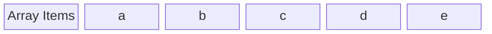
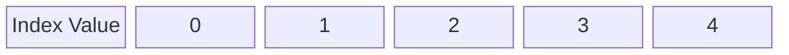

## Definition




<small>Illustration of an array and its index values. The top diagram shows the elements in an array, and the bottom diagram maps each element to its corresponding index value.</small>

&nbsp;

An array is a fundamental data structure that holds an ordered sequence of elements, each accessible by a numbered index.

Arrays take up a contiguous block of memory space—think of it like taking up continuous rows of drawers in a filing cabinet. This contiguous allocation allows us to retrieve elements by their index, as the memory address of each element can be easily calculated, making data retrieval very fast. But in return you'd need to shift entire rows whenever you insert or delete an element from an array, making these operations potentially costly in terms of performance, especially for large arrays.

In Python, lists and tuples are types of arrays-

* A Python list is a dynamic and mutable array- it can grow and shrink in size and its contents can change.

* A Python tuple is an immutable array- it cannot change in size, nor can its content change.

## Operations

Arrays support several common operations. Here are the most important ones:

* **Access - O(1)**

    This operation retrieves an element from the array using its index. Arrays store elements in contiguous memory locations, allowing for fast access. 
    
    When we access an element, the computer calculates its exact memory address using the formula: base_address + (index * element_size). This calculation takes the same amount of time regardless of the array's size, resulting in constant time complexity O(1).

* **Search - O(n)**

    Searching involves looking through the array to find a specific element. In an unsorted array, we might need to check every element until we find the one we're looking for or reach the end. As the array size (n) grows, the maximum number of checks grows proportionally, leading to a linear time complexity of O(n).

* **Insert - O(1) at the end, O(n) at the beginning or middle**

    Insertion adds a new element to the array. Adding to the end is typically O(1) as we're simply placing an element in the next available space. However, inserting at the beginning or middle is O(n) because we need to shift all subsequent elements to make room. In the worst case (inserting at the beginning), we move all n elements, hence the O(n) complexity. Note that if the array needs resizing, end insertion can occasionally take longer.

* **Delete - O(1) at the end, O(n) at the beginning or middle**

    Deletion removes an element from the array. Removing from the end is O(1) as we simply remove the last element without shifting others. However, deleting from the beginning or middle is O(n) because we need to shift all subsequent elements to close the gap. In the worst case (deleting from the beginning), we move n-1 elements, which is still O(n).

It's worth noting that in Python, lists are dynamic arrays with additional optimizations. While these principles generally apply, the exact performance may vary slightly.

## Implementation in Python

Let's start with a basic implementation of an array using Python's built-in list:

```python
# Basic array (list) in Python
array = [1, 2, 3, 4, 5]
```

Now, let's implement the operations we discussed:

```python
def access(arr, index):
    if 0 <= index < len(arr):
        return arr[index]
    else:
        return "Index out of range"

def search(arr, element):
    for i in range(len(arr)):
        if arr[i] == element:
            return i
    return -1  # Element not found

def insert(arr, element, index=None):
    if index is None:
        arr.append(element)  # Insert at the end
    else:
        arr.insert(index, element) #Insert at the defined index position

def delete(arr, index):
    if 0 <= index < len(arr):
        return arr.pop(index)
    else:
        return "Index out of range"

# Example usage
arr = [1, 2, 3, 4, 5]

print(access(arr, 2))  # Output: 3
print(search(arr, 4))  # Output: 3
insert(arr, 6)  # Insert at the end
print(arr)  # Output: [1, 2, 3, 4, 5, 6]
insert(arr, 0, 0)  # Insert at the beginning
print(arr)  # Output: [0, 1, 2, 3, 4, 5, 6]
print(delete(arr, 3))  # Output: 3
print(arr)  # Output: [0, 1, 2, 4, 5, 6]
```

In this implementation, we've created functions for each of the main operations on arrays. The access function retrieves an element at a specific index, search looks for an element and returns its index, insert adds an element either at the end or at a specified index, and delete removes an element at a given index.

These functions demonstrate the basic principles of array operations, but it's important to note that Python's built-in list methods are often more efficient and should be used in practice.

## Library/Module Equivalent

### List and Tuples

We can implement most of these operations by using the built-in methods and functions for lists:

```python
# Creating a list
arr = [1, 2, 3, 4, 5]

# Access
print(arr[2])  # Output: 3

# Search
print(arr.index(4))  # Output: 3
print(3 in arr)  # Output: True

# Insert
arr.append(6)  # Insert at the end
arr.insert(0, 0)  # Insert at the beginning

# Delete
arr.pop(3)  # Remove element at index 3
arr.remove(5)  # Remove the first occurrence of 5

# Modify
arr[1] = 10  # Change the second element to 10

# Slice
print(arr[1:4])  # Output: [10, 3, 6]

# Concatenate
arr2 = [7, 8, 9]
arr_combined = arr + arr2

# Length
print(len(arr))  # Output: 6
```

Tuples support many of the same operations as lists, but with some limitations due to their immutability:

```python
# Creating a tuple
tup = (1, 2, 3, 4, 5)

# Access
print(tup[2])  # Output: 3

# Search
print(tup.index(4))  # Output: 3
print(3 in tup)  # Output: True

# Slice
print(tup[1:4])  # Output: (2, 3, 4)

# Concatenate
tup2 = (6, 7, 8)
tup_combined = tup + tup2

# Length
print(len(tup))  # Output: 5

# Note: The following operations are not supported for tuples
# tup[1] = 10  # This would raise a TypeError
# tup.append(6)  # Tuples don't have an append method
# tup.remove(5)  # Tuples don't have a remove method
```

Python lists and tuples support many more operations besides these, and you can find them here-

[List Operations](https://www.leetpython.com/docs/The-1hr-Guide-To-Python/Python%20Data%20Types/Lists)

[Tuple Operations](https://www.leetpython.com/docs/The-1hr-Guide-To-Python/Python%20Data%20Types/Tuples)

### NumPy

While Python's built-in lists can handle many array operations, they're limited when it comes to multi-dimensional arrays and complex numerical computations. This is where ``NumPy``, a powerful library for numerical computing in Python, comes in. ``NumPy`` is particularly useful for creating and manipulating 2D and 3D arrays, which are essential in many scientific and engineering applications.

Let's explore how ``NumPy`` can create and operate on multi-dimensional arrays:

```python
import numpy as np

# Manually create a 2D array
manual_2d = np.array([[1, 2, 3],
                      [4, 5, 6],
                      [7, 8, 9]])
print(manual_2d)

"""
Output:
[[1 2 3]
 [4 5 6]
 [7 8 9]]
"""

# Create a 2D array using np.arange()
auto_2d = np.arange(9).reshape(3, 3)
print(auto_2d)

"""
Output:
 [[0 1 2]
 [3 4 5]
 [6 7 8]]
"""

# Create a 3D array using np.arange()
auto_3d = np.arange(27).reshape(3, 3, 3)
print(auto_3d)

"""
Output:
[[[ 0  1  2]
  [ 3  4  5]
  [ 6  7  8]]

 [[ 9 10 11]
  [12 13 14]
  [15 16 17]]

 [[18 19 20]
  [21 22 23]
  [24 25 26]]]
"""
```

Now that we have our arrays, let's perform some operations on them that are similar to what we did with Python lists:

```python
# Access elements (similar to list indexing)
print(manual_2d[1, 2])  # Access element at row 1, column 2
print(auto_2d[0])      # Access entire first row

"""
Output:
6
[0 1 2]
"""

# Element at position (1,2) in 2D array
print(manual_2d[1, 2])

# Slice of 2D array (first two rows, last two columns)
print(manual_2d[:2, 1:])

"""
Output:
6
[[2 3]
 [5 6]]
"""

# Search for an element
element = 5
indices = np.where(manual_2d == element)
print(f"Element {element} found at indices: {indices}")

"""
Output:
Element 5 found at indices: (array([1]), array([1]))
"""

# Insert a new row (similar to list.append())
new_row = np.array([10, 11, 12])
manual_2d = np.vstack([manual_2d, new_row])
print(manual_2d)

"""
Output:
[[ 1  2  3]
 [ 4  5  6]
 [ 7  8  9]
 [10 11 12]]
"""

# Delete a row (similar to list.pop())
auto_2d = np.delete(auto_2d, 1, axis=0)  # Delete second row
print(auto_2d)

"""
Output:
[[0 1 2]
 [6 7 8]]
"""

# Modify elements (similar to list item assignment)
manual_2d[0, :] = 0  # Set all elements in the first row to 0
print(manual_2d)

"""
Output:
[[ 0  0  0]
 [ 4  5  6]
 [ 7  8  9]
 [10 11 12]]
"""
```

We can also perform mathematical calculations with on the arrays:

```python
# Basic arithmetic operations
print(manual_2d + auto_2d)

"""
[[ 1  3  5]
 [ 7  9 11]
 [13 15 17]]
"""


# Multiplication by a scalar
print(manual_2d * 2)

"""
[[ 2  4  6]
 [ 8 10 12]
 [14 16 18]]
"""

# Matrix multiplication
print(np.dot(manual_2d, auto_2d))

"""
[[ 24  30  36]
 [ 51  66  81]
 [ 78 102 126]]
"""
```

These examples, which are just the tip of the iceberg really, demonstrate NumPy's powerful capabilities for creating and manipulating multi-dimensional arrays. It is essential for scientific computing and is widely used in professional environments for various applications:

1. **Data Analysis and Processing**

    NumPy forms the foundation for many data analysis libraries in Python, such as pandas. It's used extensively for preprocessing large datasets, performing statistical analyses, and handling missing data.

2. **Machine Learning and AI**

    Many machine learning libraries, including scikit-learn and TensorFlow, rely on NumPy arrays for efficient data representation and computation. NumPy's ability to handle large, multi-dimensional arrays is crucial for tasks like image processing and natural language processing.

3. **Scientific and Engineering Applications**

    In fields like physics, chemistry, and engineering, NumPy is used for complex calculations, simulations, and modeling. Its array operations and mathematical functions make it ideal for tasks ranging from signal processing to quantum mechanics calculations.

4. **Image and Audio Processing** 

    The library's multi-dimensional array structure is perfect for representing and manipulating image and audio data, making it a go-to tool for computer vision and audio analysis tasks.

## Use Cases

Arrays are versatile data structures with numerous applications across various domains of computer science and software development. Here are some common use cases:

* **Data Organization and Retrieval** 

    Arrays are excellent for storing and quickly accessing data in a specific order. This makes them ideal for tasks like database indexing, where rapid data retrieval is crucial.

* **Foundations for Algorithms** 

    Many algorithms rely on arrays as their basic data structure. Sorting algorithms like QuickSort and merge sort, for instance, manipulate arrays to efficiently order elements.

* **Multi-dimensional Data Representation** 
    
    Arrays are fundamental in representing complex, multi-dimensional data. This is particularly useful in scientific computing, computer graphics, and image processing, where data often needs to be organized in two or more dimensions.

Let's explore a couple of these use cases with code examples:

### Todo List

A todo list is a perfect example of data organization using an array. Each task can be an element in the array-

```python
class TodoList:
    def __init__(self):
        self.tasks = []

    def add_task(self, task):
        self.tasks.append(task)
        print(f"Added task: {task}")

    def complete_task(self, task):
        if task in self.tasks:
            self.tasks.remove(task)
            print(f"Completed task: {task}")
        else:
            print("Task not found")

    def view_tasks(self):
        if self.tasks:
            print("Current tasks:")
            for i, task in enumerate(self.tasks, 1):
                print(f"{i}. {task}")
        else:
            print("No tasks remaining")

# Example usage
todo = TodoList()
todo.add_task("Buy groceries")
todo.add_task("Pay bills")
todo.view_tasks()
todo.complete_task("Buy groceries")
todo.view_tasks()
```

In this example, we're using a list to create a simple todo list application. The TodoList class uses an array to store tasks. We can easily add new tasks using the append method, mark tasks as complete by removing them with the remove method, and view all current tasks by iterating through the array. This showcases how arrays can be used for basic data organization and management in a real-world scenario.

### Image Processing

Arrays are fundamental in image processing, where images are often represented as 2D or 3D arrays. Here's a simple example using NumPy to perform basic image operations:

```python
import numpy as np
from PIL import Image

# Open an image and convert it to a NumPy array
img = np.array(Image.open('Flower.jpg'))

# Brighten the image
brightened = np.clip(img * 1.5, 0, 255).astype(np.uint8)

# Crop the image
height, width, _ = img.shape
crop = img[height//4:3*height//4, width//4:3*width//4]

# Save the processed images
Image.fromarray(brightened).save('Flower_brightened.jpg')
Image.fromarray(crop).save('Flower_cropped.jpg')
```

This example demonstrates how arrays are used in image processing. We use ``Numpy`` to to represent the image as a multi-dimensional array. There, each pixel in the image is an element in the array and contains color information. We then perform two common image processing tasks:

* Brightening the image by multiplying all pixel values by 1.5 (and clipping to ensure values stay in the valid range).
* Cropping the image by selecting a subset of the array.

This illustrates how arrays (via ``NumPy``) allow us to easily manipulate large sets of data (pixels) in a structured way, which is crucial for tasks like image processing, scientific computing, and data analysis.

## Conclusion

Arrays are a fundamental data structure in computer science, offering a simple yet powerful way to store and manipulate collections of data. They're particularly well-suited for scenarios requiring frequent random access to elements or when the size of the data set is known in advance. However, they may be less ideal in situations demanding frequent insertions or deletions at arbitrary positions.

The significance of arrays extends far beyond their direct use. They serve as the foundation for many other data structures and algorithms:

1. Dynamic arrays (like Python's lists) build upon the basic array concept to offer resizable collections.
2. Multi-dimensional arrays form the basis for matrices and tensors, crucial in scientific computing and machine learning.
3. Many efficient sorting algorithms, such as QuickSort and Merge Sort, are designed to work directly on arrays.
4. Hash tables, which provide fast key-value lookups, often use arrays as their underlying storage mechanism.

Moreover, grasping the fundamentals of arrays sets the stage for understanding more advanced topics like memory management, cache optimization, and algorithm design. Many sorting and searching algorithms, for instance, are intimately tied to the properties of arrays.

Understanding arrays and their characteristics is crucial for several reasons:

1. Efficiency: Knowing when to use arrays can lead to more efficient code, especially in performance-critical applications.
2. Algorithm Design: Many algorithms are designed with array-like structures in mind, making array knowledge essential for algorithm implementation and analysis.
3. Memory Management: Arrays provide insights into how data is stored and accessed in memory, which is crucial for optimizing memory usage in software.
4. Problem Solving: Arrays often offer the simplest solution to many programming problems, making them a go-to tool in a developer's toolkit.

As you continue your journey in computer science and programming, you'll find that the concept of arrays underpins many more advanced topics. Whether you're working on data structures, algorithms, or even system-level programming, the principles you've learned about arrays will continue to be relevant and valuable.