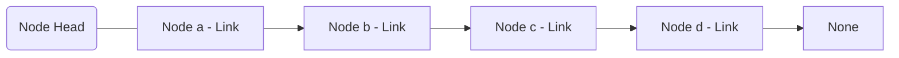
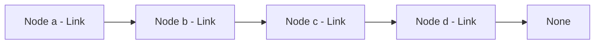
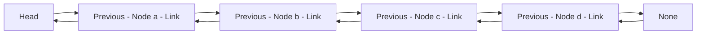
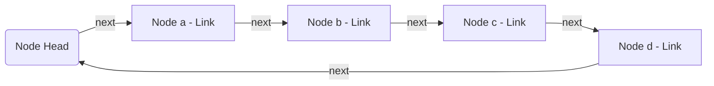
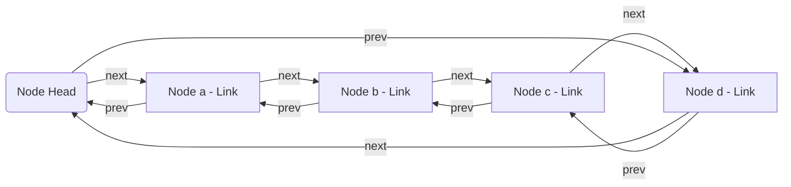

## Definition


<small>This diagram shows a singly linked list with nodes connected by links, terminating at a node that points to 'None', indicating the end of the list.</small>

&nbsp;

A linked list is a data structure consisting of a collection of **nodes** that all together represent a sequence of elements. Each **node** contains data and a reference (or **link**) to the next node in the sequence.

The primary difference between an array and a linked list comes down to how they occupy memory space in your computer. Whereas arrays take up a contiguous block of memory, linked lists do not occupy a contiguous block of memory. Instead, each **node** is stored independently in memory, containing the information and a **link** to the location of the next **node**.

So, if an array stores data in a continuous rows of drawers, a linked list stores data in drawers scattered throughout the filing cabinet, connected to one another through the **link** each **node** contains. 

This means that linked lists can grow or shrink in size easily, with new **nodes** added wherever memory is available. 

This flexibility makes linked lists particularly useful for applications where the size of the data structure can change frequently and unpredictably. But in return, accessing elements in a linked list can be more time-consuming. Unlike arrays, where a direct index can quickly locate any element, linked lists require starting at the head (the first node) and following the links from node to node until reaching the desired element. This traversal process makes access times slower compared to the direct access provided by arrays.

There are four major types of linked lists:

* **Singly Linked Lists** 



    Each node has a single link field pointing to the next node. This makes traversal straightforward but only possible in one direction—from the head to the end of the list.

* **Doubly Linked Lists** 


    Nodes in a doubly linked list contain two links: one pointing to the next node and another pointing back to the previous node. This two-way linkage allows traversal in both directions, making operations like deletion more efficient as it is easier to locate the "previous" node.

* **Circular Linked Lists** 


    In a circular linked list, the last node is linked back to the first node. This forms a circle of nodes, which can be useful for applications that require a continuous, cyclic access to the elements, such as implementing a round-robin scheduler.

* **Circular Doubly Linked Lists**


    Combining the features of both doubly linked lists and circular linked lists, the circular doubly linked list allows two-way traversal and the nodes are connected in a circle. This type is especially useful in applications where the list needs to be navigated frequently and in both directions.

We'll focus primarily on singly linked lists in this article and will explore these variations in more detail in the appendix.

## Operations

Linked lists support several common operations. Here are the most important ones:

* **Access - O(n)**

    Accessing an element in a linked list requires traversing the list from the head node, following the links until reaching the desired element. Unlike arrays, linked lists don't support direct indexing. In the worst case, you might need to traverse the entire list to reach the last element, resulting in a time complexity of O(n), where n is the number of nodes in the list.

* **Search - O(n)** 

    Searching for a specific element in a linked list involves traversing the list from the head, checking each node's data until the desired element is found or the end of the list is reached. This operation also has a time complexity of O(n) in the worst case, as you might need to check every node in the list.

* **Insert - O(1) at the head, O(n) at a specific position** 

    Insertion in a linked list can be very efficient when adding a new node at the beginning (head) of the list, as it only requires updating a few pointers, resulting in O(1) time complexity. However, inserting at a specific position in the list requires traversing to that position first, which takes O(n) time in the worst case. Once the position is found, the actual insertion is O(1).

* **Delete - O(1) for the head, O(n) for a specific element** 

    Deleting the first node (head) of a linked list is an O(1) operation, as it only involves updating the head pointer. However, deleting a specific element or a node at a particular position requires first traversing the list to find the element or position, which takes O(n) time in the worst case. Once the node to be deleted is found, the actual deletion operation is O(1).

* **Traversal - O(n)** 

    Traversing a linked list involves visiting each node in the list sequentially, starting from the head and following the links until reaching the end. This operation always takes O(n) time, as it needs to visit every node once.

These operations highlight the trade-offs inherent in the linked list structure. While insertions and deletions can be very efficient, especially at the beginning of the list, accessing or searching for specific elements can be slower compared to arrays. This makes linked lists particularly suitable for scenarios where frequent insertions and deletions are required, but random access is less common.

## Python Implementation

Let's start with a basic implementation of a singly linked list in Python:

```python
class Node:
    def __init__(self, data):
        self.data = data
        self.next = None

class LinkedList:
    def __init__(self):
        self.head = None
        self.tail = None
```

This code defines two classes: Node represents individual nodes in the list, each containing a data value and a reference to the next node. LinkedList is the list itself, initialized with a head that points to the first node (or None for an empty list).

Now, let's implement the operations we discussed:

```python
class Node:
    def __init__(self, data):
        self.data = data
        self.next = None

class LinkedList:
    def __init__(self):
        self.head = None
        self.tail = None

    def append(self, data):
        new_node = Node(data)
        if not self.head:
            self.head = new_node
            self.tail = new_node
        else:
            self.tail.next = new_node
            self.tail = new_node

    def prepend(self, data):
        new_node = Node(data)
        new_node.next = self.head
        self.head = new_node
        if not self.tail:
            self.tail = new_node

    def delete_with_value(self, data):
        if not self.head:
            return
        if self.head.data == data:
            self.head = self.head.next
            if not self.head:
                self.tail = None  # List is now empty
            return
        current = self.head
        while current.next:
            if current.next.data == data:
                if current.next == self.tail:
                    self.tail = current  # Update tail when deleting last node
                current.next = current.next.next
                return
            current = current.next

    def search(self, data):
        current = self.head
        while current:
            if current.data == data:
                return True
            current = current.next
        return False

    def print_list(self):
        current = self.head
        while current:
            print(current.data, end=" -> ")
            current = current.next
        print("None")
```

Let's break down these operations:

* append(data): Adds a new node with the given data to the end of the list. It traverses the list to find the last node, then sets its next to the new node.

* prepend(data): Adds a new node with the given data to the beginning of the list. It sets the new node's next to the current head, then updates the head to the new node.

* delete_with_value(data): Removes the first node that contains the given data. It handles cases for deleting the head and for deleting nodes elsewhere in the list.

* search(data): Traverses the list to find a node with the given data. Returns True if found, False otherwise.

* print_list(): Traverses the list and prints each node's data, showing the structure of the list.

Here's an example of how to use this linked list implementation:

```python
# Create a new linked list
ll = LinkedList()

# Append some values
ll.append(10)
ll.append(20)
ll.append(30)

# Prepend a value
ll.prepend(5)

# Print the list
ll.print_list()  # Output: 5 -> 10 -> 20 -> 30 -> None

# Search for a value
print(ll.search(20))  # Output: True
print(ll.search(25))  # Output: False

# Delete a value
ll.delete_with_value(20)
ll.print_list()  # Output: 5 -> 10 -> 30 -> None
```

## Library/Module Equivalent

Unlike arrays, which have direct equivalents in Python's built-in list type, linked lists do not have a standard library implementation in Python. The language does not provide a built-in linked list data structure.

However, Python's dynamic nature and object-oriented features allow us to implement linked lists efficiently, as we've done in the previous section. This custom implementation gives us full control over the structure and operations of the linked list.

For most use cases where you might consider using a linked list in other languages, Python's built-in list type (which is implemented as a dynamic array) or the collections.deque class (a double-ended queue) are often sufficient and more convenient. These built-in types provide efficient implementations of common operations that you might use a linked list for, such as adding or removing elements from the beginning or end of a sequence.

If you need specific linked list behavior, it's best to implement it yourself as we've done, or use a third-party library if one exists that meets your specific needs. This approach allows you to tailor the implementation to your exact requirements while maintaining the fundamental linked list structure and behavior.