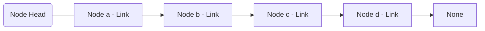
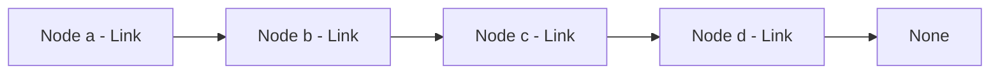
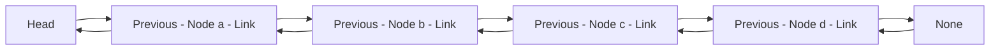
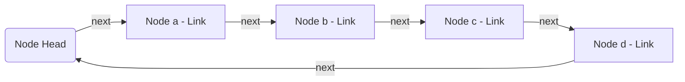
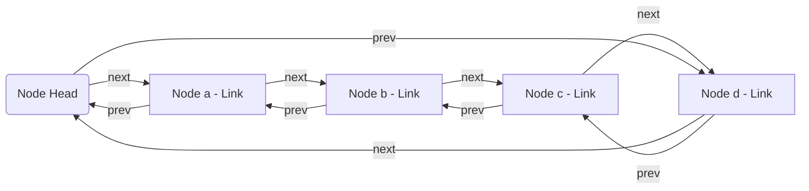

## Definition


<small>This diagram shows a singly linked list with nodes connected by links, terminating at a node that points to 'None', indicating the end of the list.</small>

&nbsp;

A linked list is a data structure consisting of a collection of **nodes** that all together represent a sequence of elements. Each **node** contains data and a reference (or **link**) to the next node in the sequence.

The primary difference between an array and a linked list comes down to how they occupy memory space in your computer.

Array take up a contiguous block of memory-think of it like data taking up continuous rows of drawers in the filing cabinet. This contiguous allocation allows us to retrieve elements by their index, as the memory address of each element can be easily calculated, making data retrieval very fast. But in return you'd need to shift entire rows of memory whenever you insert or delete an element from an array, making these operations potentially costly in terms of performance, especially for large arrays. 

In contrast, linked lists do not occupy a contiguous block of memory; instead, each node is stored independently in memory, with each containing a link to the location of the next node. 

Think of it like having data in drawers scattered throughout the filing cabinet instead of being in a continuous row. Each drawer (or **node**) not only contains the data but also a reference to the next node's location. This means that linked lists can grow or shrink in size easily, with new nodes added to whichever memory is available. 

This flexibility makes linked lists particularly useful for applications where the size of the data structure can change frequently and unpredictably. But in return, accessing elements in a linked list can be more time-consuming. Unlike arrays, where a direct index can quickly locate any element, linked lists require starting at the head (the first node) and following the links from node to node until reaching the desired element. This traversal process makes access times slower compared to the direct access provided by arrays.

There are four major types of linked lists:

* **Singly Linked Lists** 



    Each node has a single link field pointing to the next node. This makes traversal straightforward but only possible in one direction—from the head to the end of the list.

* **Doubly Linked Lists** 


    Nodes in a doubly linked list contain two links: one pointing to the next node and another pointing back to the previous node. This two-way linkage allows traversal in both directions, making operations like deletion more efficient as it is easier to locate the "previous" node.

* **Circular Linked Lists** 


    In a circular linked list, the last node is linked back to the first node. This forms a circle of nodes, which can be useful for applications that require a continuous, cyclic access to the elements, such as implementing a round-robin scheduler.

* **Circular Doubly Linked Lists**


    Combining the features of both doubly linked lists and circular linked lists, the circular doubly linked list allows two-way traversal and the nodes are connected in a circle. This type is especially useful in applications where the list needs to be navigated frequently and in both directions.

#### Use Cases

* **Dynamic Data Management**

    Unlike arrays, linked lists do not need to preallocate memory for future elements, making them suitable for dynamic and unpredictable workloads. This flexibility is particularly useful in implementing features like recently used file lists in software applications, where the list size changes frequently based on user activity.

* **Efficient Queue and Stack Implementations**

    Linked lists provide an efficient foundation for both queue and stack data structures due to their ability to add and remove elements at both ends with minimal overhead. Queues are crucial in scenarios like task scheduling systems where operations are buffered, while stacks are essential for applications involving nested function calls, such as recursive algorithms and undo mechanisms in software.

* **Memory Efficiency**

    In environments with limited memory resources, linked lists can manage memory more efficiently than arrays. Since they allocate memory for each element individually, there is no need to reserve excess memory upfront, which often occurs with array-based data structures to accommodate potential growth.

* **Order Preservation**

    Linked lists inherently maintain the order of elements as they are inserted, which is critical in applications where the sequence of operations or data is important, such as in transaction processing systems, where events must be processed in the exact order they are received.

#### Implementation in Python

Linked lists are most commonly implemented using classes. Here are basic implementations of the four major types of linked lists:

**Singly Linked List**
    
```python
class Node:
    def __init__(self, value):
        self.value = value
        self.next = None

class LinkedList:
    def __init__(self):
        self.head = None

    def append(self, value):
        """Adds a new node containing 'value' to the end of the list."""
        new_node = Node(value)
        if not self.head:
            self.head = new_node
        else:
            current = self.head
            while current.next:
                current = current.next
            current.next = new_node

    def prepend(self, value):
        """Adds a new node containing 'value' at the beginning of the list."""
        new_node = Node(value)
        new_node.next = self.head
        self.head = new_node

    def delete_with_value(self, value):
        """Deletes the first node containing 'value'."""
        current = self.head
        prev = None
        while current:
            if current.value == value:
                if prev:
                    prev.next = current.next
                else:
                    self.head = current.next
                return
            prev = current
            current = current.next

    def print_list(self):
        """Prints out the elements in the list."""
        current = self.head
        while current:
            print(current.value)
            current = current.next
```

**Doubly Linked Lists** 

```python
class DoublyNode:
    def __init__(self, value):
        self.value = value
        self.next = None
        self.prev = None

class DoublyLinkedList:
    def __init__(self):
        self.head = None

    def append(self, value):
        """Appends a new node with the given value to the end of the list."""
        new_node = DoublyNode(value)
        if not self.head:
            self.head = new_node
        else:
            last = self.head
            while last.next:
                last = last.next
            last.next = new_node
            new_node.prev = last

    def prepend(self, value):
        """Adds a new node containing 'value' at the beginning of the list."""
        new_node = DoublyNode(value)
        new_node.next = self.head
        if self.head:
            self.head.prev = new_node
        self.head = new_node

    def delete(self, value):
        """Deletes the first node containing 'value'."""
        current = self.head
        while current:
            if current.value == value:
                if current.prev:
                    current.prev.next = current.next
                if current.next:
                    current.next.prev = current.prev
                if current == self.head:
                    self.head = current.next
                return
            current = current.next

    def print_list(self):
        """Prints the list from head to tail."""
        current = self.head
        while current:
            print(current.value, end=" <-> ")
            current = current.next
        print("None")
```

**Circular Linked List**

```python
class CircularNode:
    def __init__(self, value):
        self.value = value
        self.next = None

class CircularLinkedList:
    def __init__(self):
        self.head = None

    def append(self, value):
        """Appends a node to the circular linked list."""
        if not self.head:
            self.head = CircularNode(value)
            self.head.next = self.head
        else:
            new_node = CircularNode(value)
            current = self.head
            while current.next != self.head:
                current = current.next
            current.next = new_node
            new_node.next = self.head

    def print_list(self):
        """Prints the list starting from the head."""
        current = self.head
        if self.head:
            while True:
                print(current.value, end=" -> ")
                current = current.next
                if current == self.head:
                    break
            print("HEAD")
```

**Circular Doubly Linked List**

```python
class CircularDoublyNode:
    def __init__(self, value):
        self.value = value
        self.next = None
        self.prev = None

class CircularDoublyLinkedList:
    def __init__(self):
        self.head = None

    def append(self, value):
        """Appends a new node to the end of the circular doubly linked list."""
        new_node = CircularDoublyNode(value)
        if not self.head:
            self.head = new_node
            self.head.next = self.head
            self.head.prev = self.head
        else:
            last = self.head.prev
            last.next = new_node
            new_node.prev = last
            new_node.next = self.head
            self.head.prev = new_node

    def print_list(self):
        """Prints the list starting from the head."""
        current = self.head
        if self.head:
            while True:
                print(current.value, end=" <-> ")
                current = current.next
                if current == self.head:
                    break
            print("HEAD")
```